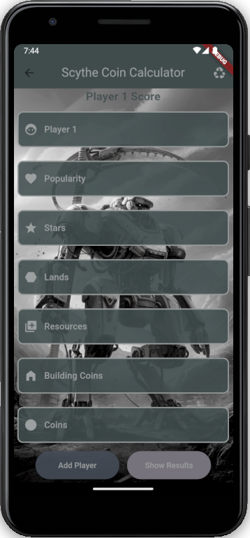
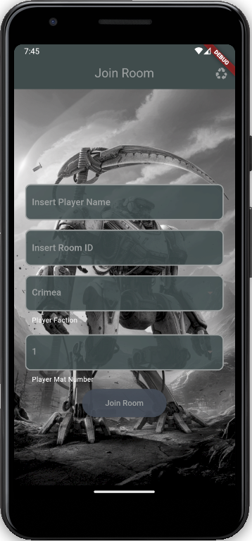
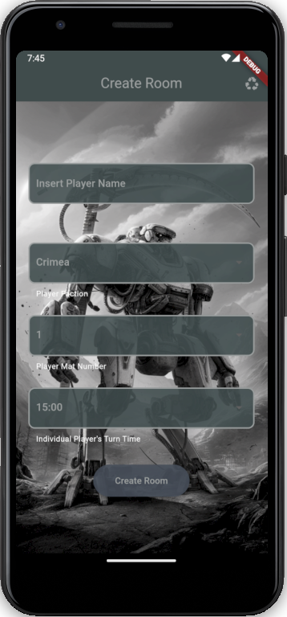

# Scythe Companion

[]()
[](https://github.com/Matos182/scythe-companion/actions/workflows/ci.yml)

Android companion app for physical Scythe games: offline final-score counting, plus online rooms with turn order, per-player turn timers, reconnect support, and local “your turn” notifications.

This is an unofficial helper app. It does not include copyrighted faction boards, encounter cards, rule text, or expansion content.

<p align="center">
  
  
  
</p>

## What it does

- Offline coin calculator for final scoring.
- Multi-player score table with winner/tie ranking.
- Online game rooms backed by a Node/socket.io server.
- Server-resolved faction-wheel turn order.
- Per-player remaining turn timers, pause/resume, and pass-turn flow.
- Presence and reconnect: players can drop and rejoin with their saved seat.
- Runtime server URL setting, so the APK does not need rebuilding for a new host.
- QR room sharing from the lobby and in-app QR scanning on the join screen.
- Android local notification when it becomes your turn while the app is backgrounded.

## Install for players

There is no prebuilt APK download. Players build the app from source (see **Build from source** below), then:

1. Open Scythe Companion and tap the gear icon.
2. Enter the server URL you configured on your own server (see **Self-host** below) — there is no public/default server.
3. Create a room and share the room code or lobby QR. Friends open Join Room, scan the QR, choose their faction/mat, and join.

## Self-host in 10 minutes

The production server is a Docker Compose stack:

```text
Internet → Caddy (:443 HTTPS) → Node socket.io server (:3000 inside Docker)
```

Quick path:

```bash
git clone https://github.com/Matos182/scythe-companion.git
cd scythe-companion
cp server/.env.example server/.env
printf 'DOMAIN=scythe.yourdomain.com\n' > .env
# edit server/.env: set CORS_ORIGIN=https://scythe.yourdomain.com
docker compose up -d --build
curl https://scythe.yourdomain.com/healthz
```

Full deployment guide: [docs/DEPLOY.md](./docs/DEPLOY.md).

For a LAN game without TLS, run the server directly and point the app at `http://<laptop-ip>:3000`:

```bash
cd server
npm ci
npm start
```

## Build from source

Requirements:

- Flutter/Dart stable.
- Android SDK for Android builds.
- Node.js 22+ for the server.

Flutter app:

```bash
flutter pub get
dart format --set-exit-if-changed .
flutter analyze
flutter test
flutter build apk --debug
```

Server:

```bash
cd server
npm ci
npm run lint
npm test
npm start
```

Signed release APKs need a private keystore. The model-written runbook is in [docs/RELEASE.md](./docs/RELEASE.md); real keystores and passwords stay out of the repo.

## Architecture sketch

- Flutter UI uses Provider with repository/notifier seams.
- Widgets do not own sockets or timers.
- `SocketService` owns socket.io handlers and translates wire events into typed streams.
- `GameRepository` owns player identity, saved sessions, runtime server URL changes, and reconnect orchestration.
- `RoomNotifier` exposes room state to pages and folds timer ticks into typed models.
- The Node server keeps rooms in memory with a TTL sweeper; no MongoDB is required.
- Timer state is server-authoritative: one timer handle per room, one active countdown per current player.
- `/healthz` exposes `protocolVersion`; the client probes it before connecting so stale APK/server combinations fail loudly.

More details:

- Wire protocol: [docs/PROTOCOL.md](./docs/PROTOCOL.md)
- Deployment: [docs/DEPLOY.md](./docs/DEPLOY.md)
- Release process: [docs/RELEASE.md](./docs/RELEASE.md)
- Changelog: [CHANGELOG.md](./CHANGELOG.md)
- Target design history: [orchestra/02_ARCHITECTURE.md](./orchestra/02_ARCHITECTURE.md)

## Project history and coordination docs

The `orchestra/` directory is living project history for the multi-model development relay: audit, roadmap, decisions, progress board, and hand-off notes. It is useful context for contributors, but it is not player-facing documentation.

## License

This project is licensed under the [MIT License](LICENSE).

## Acknowledgements

Inspired by Scythe, designed by Jamey Stegmaier and published by Stonemaier Games. Scythe Companion is an unofficial fan-made utility.

## Support

Thank you!

XMR Address:
`46cX3Gw71JyAoP91cde3YgFPV4uDopiSS2TTdsZyjk4nGy5SuYvBSeoYwscnfr57eN6b7Pp5sZMzrHNhjs22vHESBD2bRrz`

BNB Smart Chain Address:
`0x363365b8E01f4e6EbBc2630467c3354b4b74EC0C`

Solana Address:
`1xDA48D8LBd3fYeUXuvVx6VNTHSe8BZCevhDb8d3Jcf`
